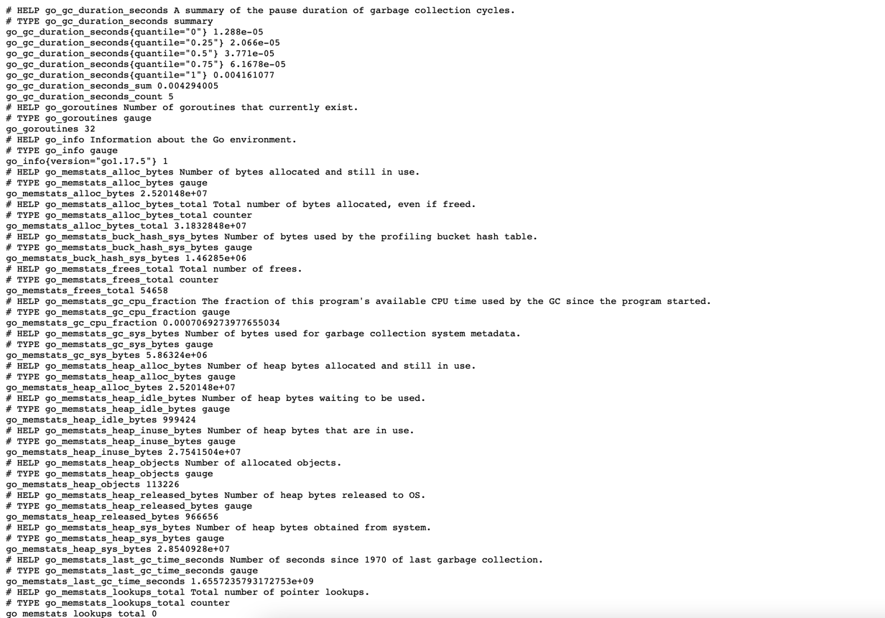
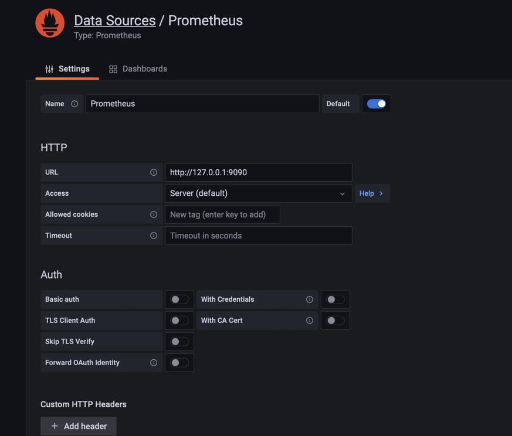
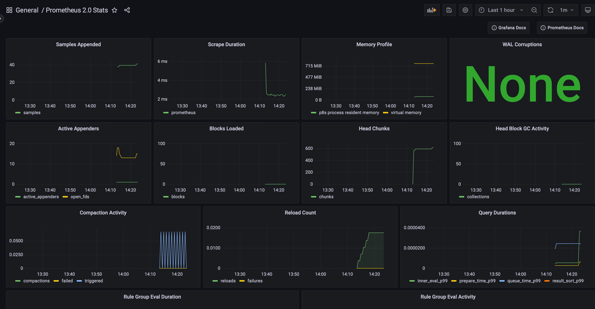

# Prometheus та Grafana

Встановлення Prometheus
~~~
sudo adduser prometheus

wget https://github.com/prometheus/prometheus/releases/download/v2.32.1/prometheus-2.32.1.linux-amd64.tar.gz
tar -xvf prometheus-2.32.1.linux-amd64.tar.gz
sudo mkdir -p /data /etc/prometheus
cd prometheus-2.32.1.linux-amd64
sudo mv prometheus promtool /usr/local/bin/
sudo mv consoles/ console_libraries/ /etc/prometheus/
sudo mv prometheus.yml /etc/prometheus/prometheus.yml
sudo chown -R prometheus:prometheus /etc/prometheus/ /data/
cd
rm -rf prometheus*
prometheus --version
~~~
Налаштування демона
~~~
sudo nano /etc/systemd/system/prometheus.service
~~~
із контентом
~~~
[Unit]
Description=Prometheus
Wants=network-online.target
After=network-online.target

StartLimitIntervalSec=500
StartLimitBurst=5

[Service]
User=prometheus
Group=prometheus
Type=simple
Restart=on-failure
RestartSec=5s
ExecStart=/usr/local/bin/prometheus \
  --config.file=/etc/prometheus/prometheus.yml \
  --storage.tsdb.path=/data \
  --web.console.templates=/etc/prometheus/consoles \
  --web.console.libraries=/etc/prometheus/console_libraries \
  --web.listen-address=0.0.0.0:9090 \
  --web.enable-lifecycle

[Install]
WantedBy=multi-user.target
~~~
увімкнення сервісу
~~~
sudo systemctl enable prometheus
sudo systemctl start prometheus
sudo systemctl status prometheus
~~~

Встановлення Grafana

~~~
sudo apt update
sudo apt-get install -y gnupg2 curl software-properties-common
curl https://packages.grafana.com/gpg.key | sudo apt-key add -
sudo add-apt-repository "deb https://packages.grafana.com/oss/deb stable main"
sudo apt update
sudo apt -y install grafana
sudo systemctl start grafana-server
sudo systemctl enable grafana-server
sudo systemctl status grafana-server
~~~

