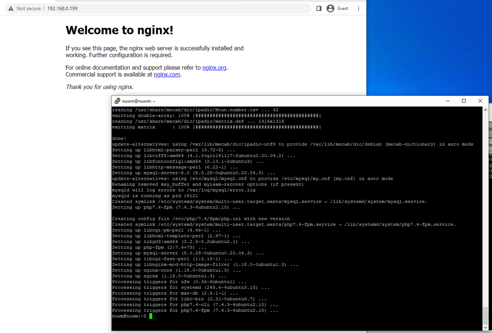
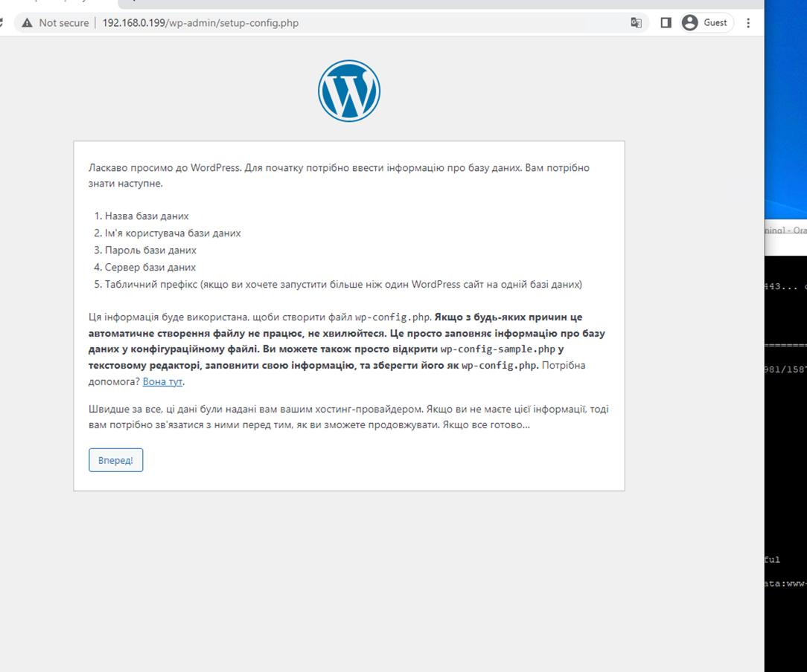
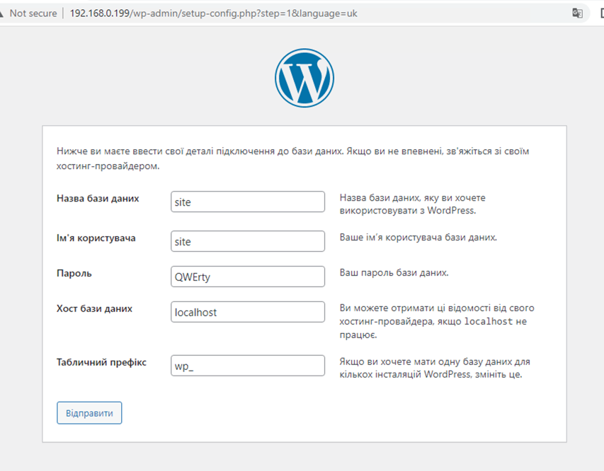
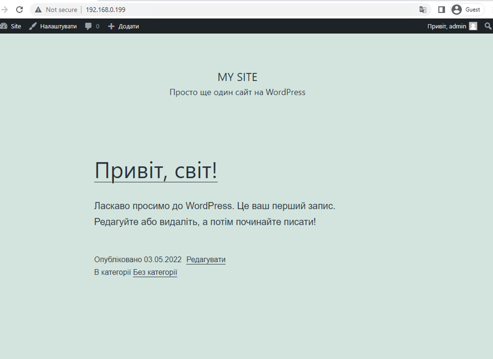

# Встановлення LEMP

Встановимо php nginx MySQL
~~~
sudo apt install nginx php-fpm php-mysql mysql-server mysql-client
~~~

Завантажимо Wordpress та розархівуємо wordpress

~~~
wget https://uk.wordpress.org/latest-uk.tar.gz && tar -xf latest-uk.tar.gz
~~~

Скопіюємо Wordpress в `/var/www/`

~~~
sudo cp -r wordpress/ /var/www/ && sudo chown -R www-data:www-data /var/www/wordpress
~~~

Сконфігуруємо для Nginx `/etc/nginx/sites-available/default`

~~~
upstream php {
        server unix:/var/run/php/php7.4-fpm.sock;
}

server {
        server_name default;
        
        root /var/www/wordpress;
        index index.php;

        location = /favicon.ico {
                log_not_found off;
                access_log off;
        }

        location = /robots.txt {
                allow all;
                log_not_found off;
                access_log off;
        }

        location / {
                try_files $uri $uri/ /index.php?$args;
        }

        location ~ \.php$ {
                include fastcgi_params;
                fastcgi_intercept_errors on;
                fastcgi_pass php;
                fastcgi_param  SCRIPT_FILENAME $document_root$fastcgi_script_name;
        }

        location ~* \.(js|css|png|jpg|jpeg|gif|ico)$ {
                expires max;
                log_not_found off;
        }
}
~~~

Створимо юзера та базу в MySQL. Для авторизації в cli MySQL `sudo mysql -u root`

~~~
create database site;
CREATE USER 'site'@'localhost' IDENTIFIED BY 'QWErty';
GRANT ALL PRIVILEGES ON site.* TO 'site'@'localhost';
~~~

