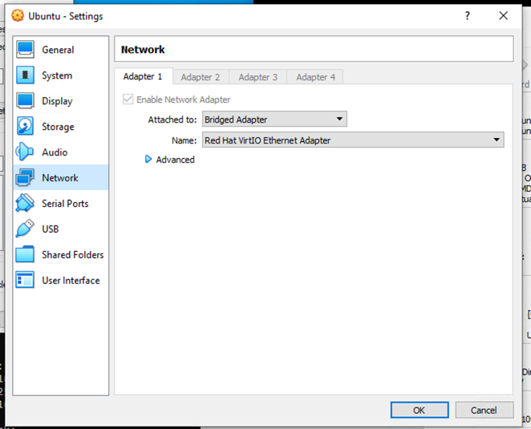
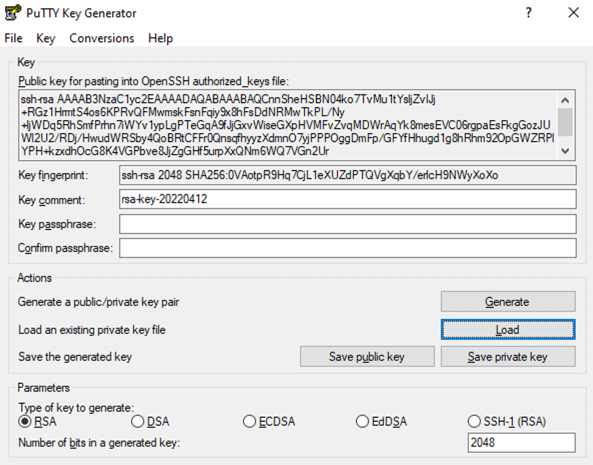
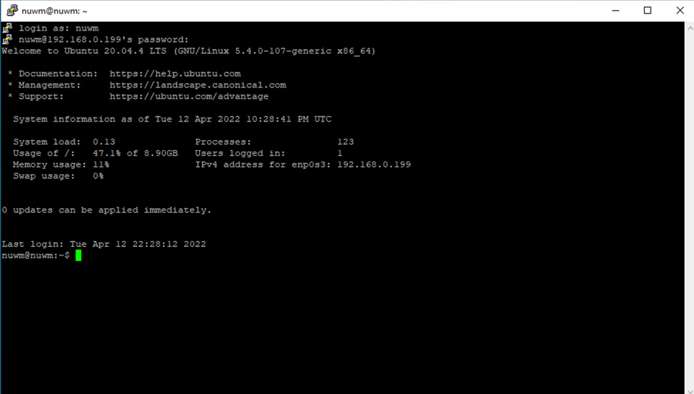
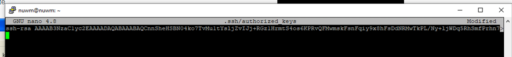
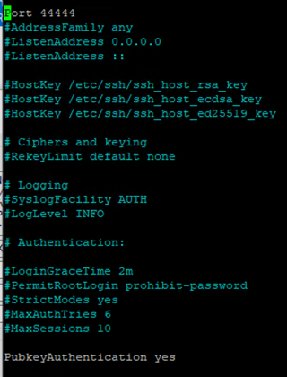
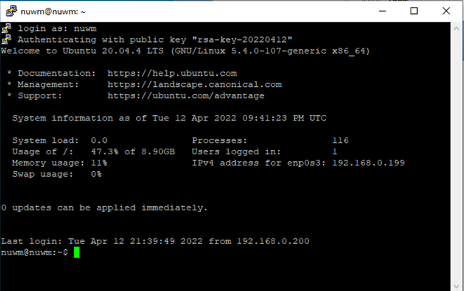

Змінимо налаштування мережевого адаптера на bridge для того, щоб віртуальна машина стала доступною через мережу.

Згенеруємо ключ для доступу по ssh для віртуальної машини

Підʼєднаємось до віртуальної машини з допомогою паролю

Налаштуємо авторизацію з допомогою ключа, додавши його у файл authorized_keys та змінимо порт для авторизації

Авторизація з допомогою ключа.

SSH тунелі також можна використовувати для доступу із локального ПК до сервісів які доступні на віддаленому сервері, але доступні лише локально на віддаленому сервері.
Наприклад можна організувати форвардинг порта серверу якій доступний тільки локально на сервері на порт на свому локальному компʼютері. 