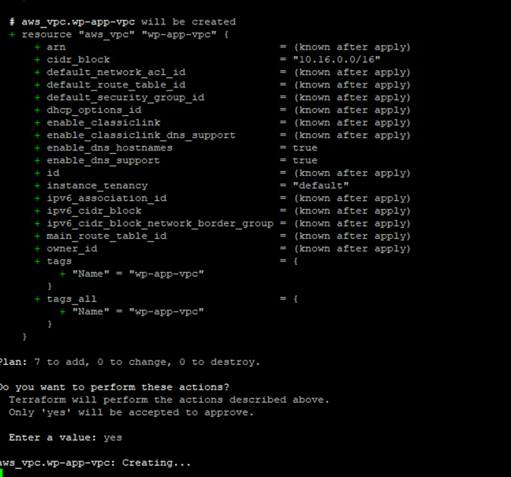
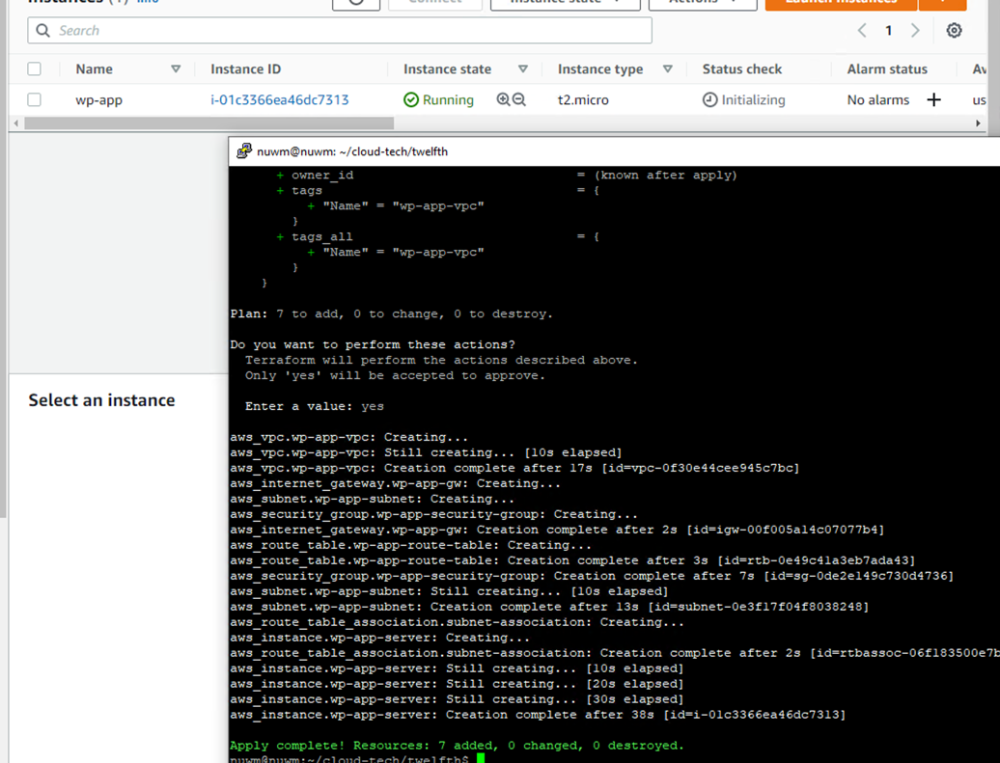

# Розгортання додатку на AWS

Створено користувача для terraform який авторизується лише програмно та для доступу використовується ключ та сікрет

Створено файл з налаштуваннями для terraform (main.tf)

Для того, щоб ключі використано змінні оточення
export AWS_ACCESS_KEY_ID=key
export AWS_SECRET_ACCESS_KEY=secret

Командою `terraform apply` створено інстенс

